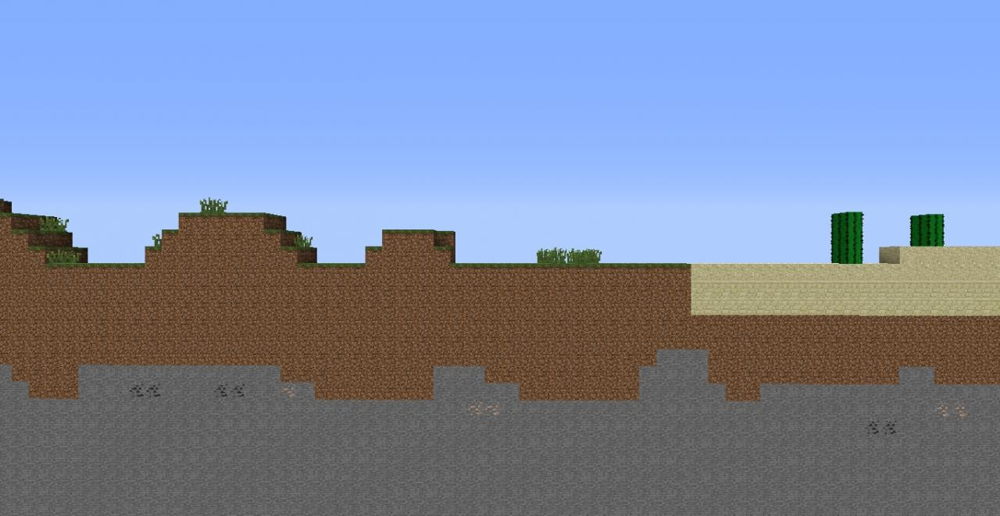
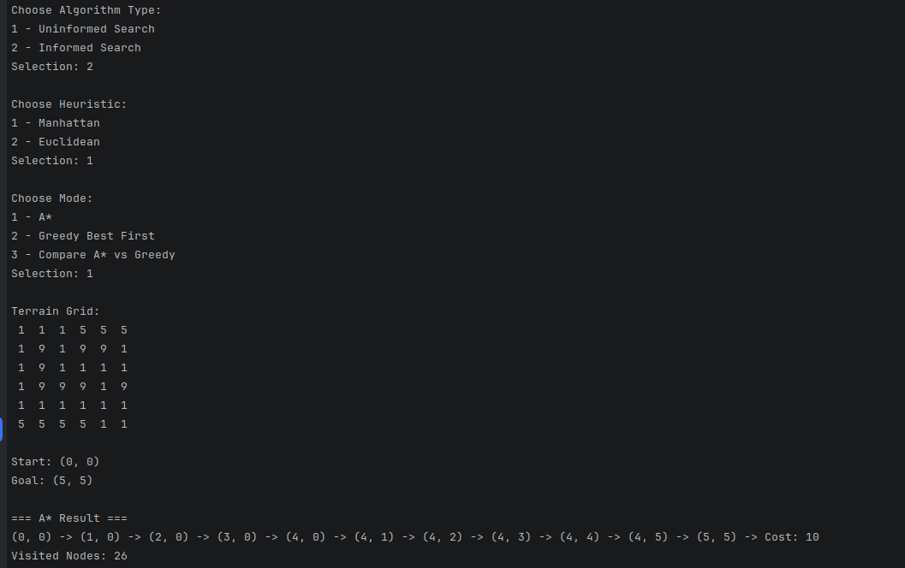
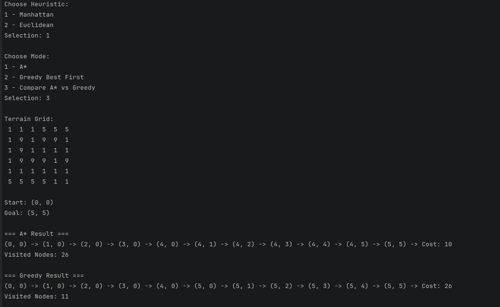
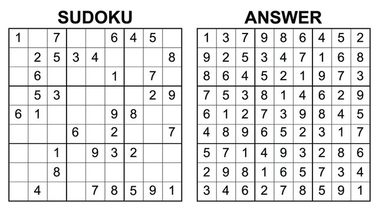
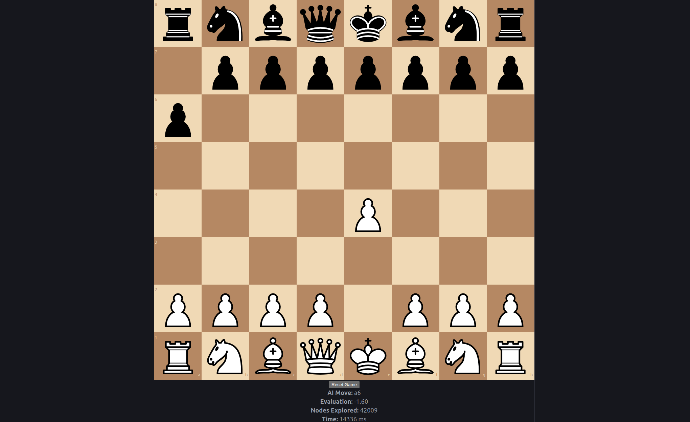
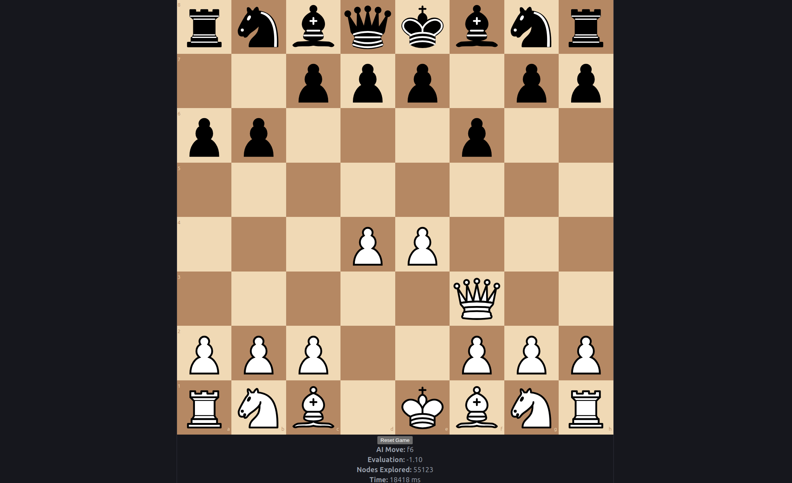

# PSS-Search-Algorithms

## Uniformed search - Flood Fill

This is an application that uses two uninformed search algorithms, as described on page 81 of the book "Artificial Intelligence: A Modern Approach.".
`Flood fill` is essentially having the same effect as the `bucket fill` tool from MS Paint.

### Problem
Given a matrix of pixel color values as integers, select the a pixel (row and column) and a new color (an integer value) and all the pixels connected to
the selected one with the same pixel value have to change their values to the new input. This is a classical graph traversal problem.


### Algorithms
The implemented algorithms are:
- DFS (Depth First Search)
- BFS (Breath FIrst Search
- A small comparative approach (taking into account time, visited nodes, steps, and frontier size)

### Interesting Starting Positions

- (0,0) → top-left corner of color 1 → open area, BFS will expand in rings, DFS will snake through.
- (4,0) → color 5 → narrow corridor around obstacles → tests DFS deep path vs BFS spread.
- (8,8) → color 11 → isolated island in center → small frontier difference.
- (12,0) → mixed colors 13 & 14 → tests algorithm choosing which direction to explore first.

### Installation
1. Make sure you have .NET 10 Runtime and SDK installed 
2. Clone the project locally
3. Run `dotnet restore` to install packages
3. Run `dotnet build` to build binaries
4. Run `dotnet run --project SearchAlgorithms.ConsoleApp` to run the app.

### Visuals
#### Input Menu

#### Comparison result


## Informed search - Terrain Navigation

This is an application that uses informed search algorithms, also described in "Artificial Intelligence: A Modern Approach", to solve a `terrain-based` pathfinding problem.
Unlike uninformed search, these algorithms use a `heuristic function` to guide the search toward the goal more efficiently.

### Problem

Given a grid representing terrain, where each cell contains a movement cost, the goal is to find a path from a start position to a goal position such that the total traversal cost is minimized.

- Each cell value represents the cost of entering that cell
- Cells with high values can act as obstacles (in this case >= 9 means an obstacle and will not be taken into consideration)
- Movement is allowed in four directions (up, down, left, right)

This problem models robot navigation, where a robot must find the most efficient path through uneven terrain.


### Algorithms

The implemented algorithms are:

- A* (A-Star Search)

    Uses both:
    - g(n) → cost from start to current node
    - h(n) → heuristic estimate to goal
    - f(n) = g(n) + h(n)


- Greedy Best-First Search

    Uses only:
    - h(n) → heuristic estimate


- A small comparative approach (displays comparison results: path found, total cost, number of visited nodes)

### Heuristics
Two heuristic functions are implemented:

#### Manhattan Distance 
(n is current node and its compared to the goal node)
```
h(n) = |x1 - x2| + |y1 - y2|
```
Because of the absolute value, it will try to expand more `grid-aligned` paths (straight).

#### Euclidean Distance
(n is current node and its compared to the goal node)
```
h(n) = sqrt((x1 - x2)^2 + (y1 - y2)^2)
```
Because of the smoother difference it will try more direct paths to the goal as well.

### Installation
1. Make sure you have .NET 10 Runtime and SDK installed
2. Clone the project locally
3. Run `dotnet restore` to install packages
3. Run `dotnet build` to build binaries
4. Run `dotnet run --project SearchAlgorithms.ConsoleApp` to run the app.

### Visuals
#### Input Menu

#### Comparison result


## Local search - Sudoku Solver

This is an application that uses local search algorithms, also described in "Artificial Intelligence: A Modern Approach", to solve a `terrain-based` pathfinding problem.
Unlike the previous search algorithms, here we are takling an optimization problem that doesn't concern with a global optimum solution, instead often finding local ones.

### Problem

We are talking about a classical game of sudoku, where you have a 9x9 grid and have to fill in the tiles with digits 1-9 such that there are no duplicates on either row, or 
column. There are some starting tiles already filled, which we'll call `fixed`. A properly formed 9x9 Sudoku must have at least 17 starting clues to have only one unique solution. 
It has been proven that puzzles with 16 or fewer clues do not have a unique solution.

The challenge lies in efficiently finding a valid configuration among a very large search space.



This problem is well-suited for local search algorithms, where we iteratively improve a candidate solution rather than constructing one step-by-step.

### Algorithms

The application has 3 modes:
- manual mode
- random solver mode (at each step, performs a random modification on non-fixed tiles)
- simulated annealing mode

The way the last one works is the following: First, we have to complete the initial state. Each 3x3 sub-grid is filled with distinct digits from 1-9 in non-fixed spots.

Afterwards, for `neighbour generation`, we select a random 3x3 sub-grid and swap 2 non-fixed values inside. This maintains sub-grid validity while exploring.

For `cost function` I have chosen:
```
Cost = number of duplicate values in all rows + all columns
```
A valid Sudoku board will have a cost of 0 and the lower it is the better.
Next, given:
- current state cost = `C`
- neighbour state cost = `C'`
- temperature `T`
The decision rule is that if we get a lower score for our neighbour, we take it, if not, we can still accept it with the following probability:
```
P = exp((C - C') / T)
```

Finally, the initial temperature is computed as standard deviation of the cost over 200 random states (starting from the same one with fixed tiles) and 
the cooling rate is set to 0.995, though both can be changed.

### Metrics

For now, I have included the following:
- number of iterations
- conflicts
- temperature

### Installation
1. Make sure you have node (at least 20) and npm installed.
2. Clone the project locally
3. Run `cd sudoku-local-search` to enter the React-Vite project directory
3. Run `npm install` to install packages
4. Run `npm run dev` to run the app.
5. Navigate to `http://localhost:5173/` and test it.

### Visuals
#### Input Menu

#### Comparison result


## Adversarial Search - Chess

This is an application that uses adversarial search algorithms, also described in "Artificial Intelligence: A Modern Approach", to solve a `terrain-based` pathfinding problem.
Unlike the previous search algorithms, here we are takling an optimization problem between 2 systems in a turn-based approach. At its core lies the minimax principle.

### Problem

The problem at hand is the classical game of chess. Used widely in gaming and competitive environments, adversarial search allows agents to make optimal decisions in the presence of an opponent.
Chess is that type of game: turn-based game where each player tries to beat the other with the same rules, with either one winning, or reaching a drawing state.

The challenge lies in how to model the game evaluation for minimax algorithm.


As a way of speedup, the algorithm will be ran in a `web worker` for each move and I've tried to split the search space into subsets to use parallel workers.

### Algorithm

I implemented minimax algorithm with alpha-beta pruning, treating White as the maximizer and Black as the minimizer. We'll start with score evaluation.

#### Evaluation

Each piece has its corresponding score in a record in `src/utils/constants.ts`. The actual score for a board state is calculated in `src/adversarial/evaluation.ts`.
Here we have the following gated checks:
- if it's your turn to move and you're checkmated -> instant loss (if white, score = -9999, else 9999)
- if game is draw, score 
- then, we add to the accumulator the piece scores for white and subtract the piece scores for black (if it's on a center square add 0.5 to that value)
- then, take 10% of the total available moves and either add, or subtract that number from the score based on player type (optional)
- finally, check `game.inCheck()` to see if current player is in check and add, or subtract 0.5 depending on player type to enforce the impact of a check

#### Minimax with alpha-beta pruning

Condition to terminate is either if `depth === 0`, or if `game.isGameOver()` then we evaluate and return that board score.<br>
Then we parse through all available moves from current position, and sort them:
- if we're about to capture a new pieces
- then if we're about to promote
- then the rest

This was done, to help pruning even more and promote those branches of capture and promotion more than those with simple moves.

Then we do the backtracking:
```js
game.move(...)
alphaBeta(...)
game.undo()
```
and finally the alpha-beta pruning.

#### Web worker

Our algorithm will run on a web worker. It's an object created with the simple means for web content to run scripts in background threads. I used it
because I was permanently encountering freezes, most likely blocking the main application thread for the UI. These are the usual solutions for running long,
intensive processes. Web workers represent their own separate process, thus spinning up a separate thread.

We are giving a worker a set of moves and for each it evaluates the minimax alpha-beta pruning algorithm to obtain the best move out of those.
#### Parallel workers

While it was an evident speedup, the application was slow with one worker. Since it receives a subset of moves to evaluate the strategy is to paralelize:
1. Create a pool of workers (beware of number of threads available)
2. Use a queue for worker jobs
3. Use a dictionary map to keep track of which worker has what job (for knowing the subset of moves split)
4. Then we distribute the moves evenly<br>
```js
moves.forEach((move, i) => chunks[i % numWorkers].push(move));
```
5. Finally we combine the results and pick the best move globally

#### React hook for orchestration

Here we keep:
- current game state
- UI representation of the game
- metrics collected
- pool of workers

And after initialization of all of those, we start the game with a player move and immediately after we trigger our adversarial move. Here we wait for all workers
to be done, before getting the best result and applying the move. Essentially, since game will always start with the player which is White, the algorithm will always start
as Black and go from there.

### Metrics

For now, I have included the following:
- global evaluation score
- nodes explored
- time taken for evaluation move

### Installation
1. Make sure you have node (at least 20) and npm installed.
2. Clone the project locally
3. Run `chess-adversarial-search` to enter the React-Vite project directory
3. Run `npm install` to install packages
4. Go into `src/hooks/useChessGame.ts` and modify the number at line 22 from 6 to whatever number of open threads you're comfortable with
5. Run `npm run dev` to run the app.
6. Navigate to `http://localhost:5173/` and test it.

### Visuals
#### Example 1

#### Example 2
