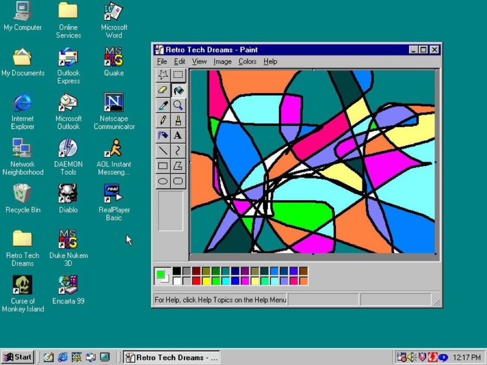
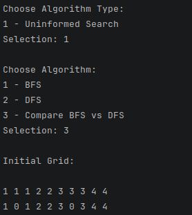
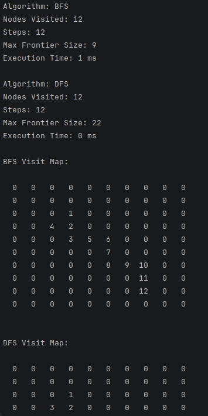

# PSS-Search-Algorithms

## Uniformed search - Flood Fill

This is an application that uses two uninformed search algorithms, as described on page 81 of the book "Artificial Intelligence: A Modern Approach.".
`Flood fill` is essentially having the same effect as the `bucket fill` tool from MS Paint.

### Problem
Given a matrix of pixel color values as integers, select the a pixel (row and column) and a new color (an integer value) and all the pixels connected to
the selected one with the same pixel value have to change their values to the new input. This is a classical graph traversal problem.

### Algorithms
The implemented algorithms are:
- DFS (Depth First Search)
- BFS (Breath FIrst Search
- A small comparative approach (taking into account time, visited nodes, steps, and frontier size)

### Installation
1. Make sure you have .NET 10 Runtime and SDK installed 
2. Clone the project locally
3. Run `dotnet restore` to install packages
3. Run `dotnet build` to build binaries
4. Run `dotnet run --project SearchAlgorithms.ConsoleApp` to run the app.

### Visuals
#### Input Menu

#### Comparison result
